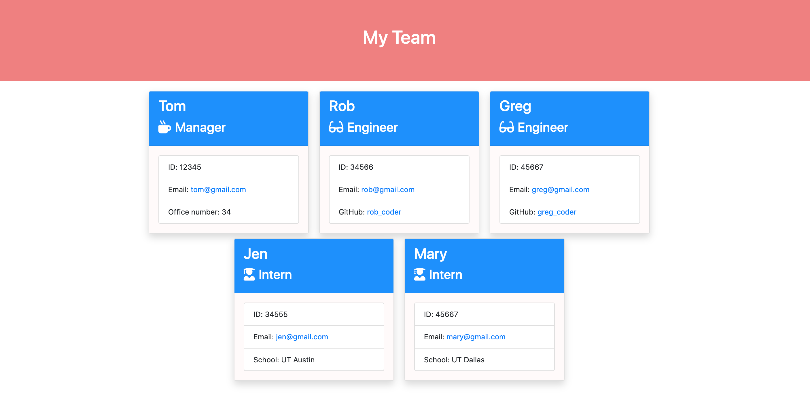

# Homework 09 - Template Engine - Employee Summary

## Objective
a Node CLI that takes in information about employees and generates an HTML webpage that displays summaries for each person. Since testing is a key piece in making code maintainable, you will also be ensuring that all unit tests pass.
## Acceptance Criteria
- User can use the CLI to generate an HTML page that displays information about their team.
- Functional application.
- All tests must pass.
- GitHub repository with a unique name and a README describing the project.

## Application

### Github Repository URL
https://github.com/thammaraku/homework_09_employee_summary

### Application Screenshot

### Tutorial Video Link
https://drive.google.com/file/d/1g0VkKf3TioidlkZ4Ba2Wd0x9mpEvvWK6/view?usp=sharing

## Knowledge learned from this assignment
1. How to use constructor and class
2. How to use Inquirer package to interact and get information from the user 
3. How to run a test by using jest
4. How to use multiple HTML templates to compose to a main page
5. How to use pass date to placeholder HTML
6. How to use file system package to interact with the files